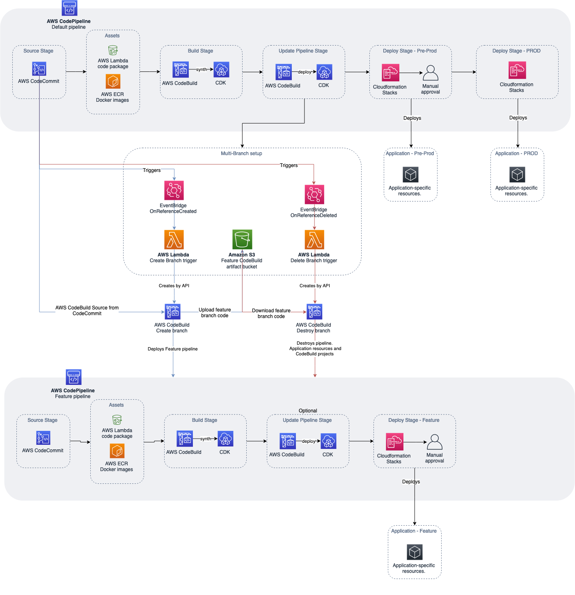

# Using AWS CDK Pipelines and AWS Lambda for multi-branch pipeline management and infrastructure deployment. 

This project shows how to use the [AWS CDK Pipelines module](https://docs.aws.amazon.com/cdk/api/latest/docs/pipelines-readme.html) to follow a Gitflow development model
using AWS CDK. Software development teams often follow a strict branching strategy during the
development lifecycle of a solution. It is common for newly created branches to need their own isolated
copy of infrastructure resources in order to develop new features.

[CDK Pipelines](https://docs.aws.amazon.com/cdk/api/latest/docs/pipelines-readme.html) is a construct library module for painless continuous delivery of AWS CDK applications.
CDK Pipelines are self-updating: if you add application stages or stacks, the pipeline automatically
reconfigures itself to deploy those new stages and/or stacks.

The following solution creates a new AWS CDK Pipeline within a development account for every new
branch created in the source repository (AWS CodeCommit). When a branch is deleted, the pipeline and
all related resources are destroyed from the account as well. This GitFlow model for infrastructure
provisioning allows developers to work independently from each other, concurrently, even in the same
stack of the application.


## Overview of the solution



## Prerequisites 
Before setting up this project, you should have the following prerequisites:
* An AWS account
* AWS CDK installed
* Python3 installed

## Initial setup 
[Create a new AWS CodeCommit repository](https://docs.aws.amazon.com/codecommit/latest/userguide/how-to-create-repository.html) in the AWS Account and region where you want to deploy
the pipeline and upload the source code from this repository. In the config.ini file, change the
repository_name and region variables accordingly.

Make sure to set up a fresh python environment. Install the dependencies:

`pip install -r requirements.txt`

Run the initial-deploy.sh script to bootstrap the development and production environments and to
deploy the default pipeline. You’ll be asked to provide the following parameters: (1) Development
account ID, (2) Development account AWS profile name (3) Production account ID, (4) Production
account AWS profile name.

`sh ./initial-deploy.sh --dev_account_id <YOUR DEV ACCOUNT ID> --
dev_profile_name <YOUR DEV PROFILE NAME> --prod_account_id <YOUR PRODUCTION
ACCOUNT ID> --prod_profile_name <YOUR PRODUCTION PROFILE NAME>`

## How to use

[Lambda S3 trigger project](https://github.com/aws-samples/aws-cdk-examples/tree/master/python/lambda-s3-trigger) from AWS CDK Samples is used as infrastructure resources to demonstrate
this solution. The content is placed inside the *src* directory and is deployed by the pipeline. Replace the content of this repository with your infrastructure code. Use [CDK Constructs](https://docs.aws.amazon.com/cdk/latest/guide/constructs.html) to combine your infrastructure code into one stack and reference this in the application stage inside *src/application_stage.py*. 

### Create a feature branch 

On your machine’s local copy of the repository, create a new feature branch using the git commands
below. Replace user-feature-123 with a unique name for your feature branch. Note: this feature branch name must comply with the [AWS CodePipeline naming restrictions](https://docs.aws.amazon.com/codepipeline/latest/userguide/limits.html#:~:text=Pipeline%20names%20cannot%20exceed%20100,letters%20A%20through%20Z%2C%20inclusive.) for it will be used to name a unique
pipeline later in this walkthrough. 

```
# Create the feature branch
git checkout -b user-feature-123
git push origin user-feature-123
```

The first AWS Lambda function will deploy the CodeBuild project which then deployes the feature
pipeline. This can take a few minutes. You can log into the AWS Console and see the CodeBuild project
running under AWS CodeBuild. After the build is successfully finished, you can see the deployed feature pipeline under AWS
CodePipelines.

### Destroy a feature branch 
There are two common ways for removing feature branches. The first one is related to a pull request,
also known as a “PR”, which occurs when merging a feature branch back into the default branch. Once it
is merged, the feature branch will be automatically closed. The second way is to delete the feature
branch explicitly by running the below git commands.

```
# delete branch local
git branch -d user-feature-123

# delete branch remote
git push origin --delete user-feature-123
```


## Security

See [CONTRIBUTING](CONTRIBUTING.md#security-issue-notifications) for more information.

## License

This library is licensed under the MIT-0 License. See the LICENSE file.

